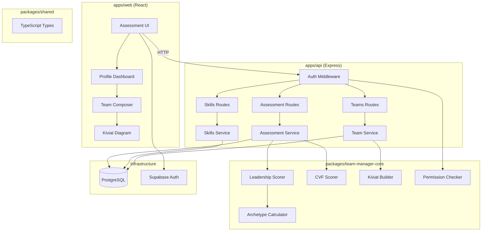

# team-manager — Architecture

## System Overview



## Data Flow

### Assessment Flow
```
User fills 12 questions (1-10)
→ API: POST /assessments/leadership
→ Core: calculateLeadershipScores(answers)
→ Core: determineArchetype(scores)
→ Core: mapGoleman(scores)
→ DB: save LeadershipAssessment
→ Response: { scores, archetype, golemansStyles }
```

### CVF Flow
```
User distributes 100pts × 6 categories
→ Validation: each category sums to 100
→ API: POST /assessments/cvf
→ Core: calculateCVFScores(categories)
→ DB: save CVFAssessment
→ Response: { results: { clan, adhocracy, market, hierarchy } }
```

### Team Composition Flow
```
Manager selects team members
→ API: POST /teams
→ Core: buildKiviatData(members[])
→ Aggregate: archetype distribution
→ Aggregate: CVF averages
→ Aggregate: skill averages
→ Response: { team, kiviatData }
```

## Permission Flow

```
Request arrives
→ Supabase Auth: verify JWT
→ Load User + Org permission level
→ Check permission: canPerformAction(user, org.permissionLevel, action)
→ Allow / 403 Forbidden
```

## Database Schema

```
organizations
  id, name, permission_level

users
  id, email, name, org_id, role

leadership_assessments
  id, user_id, answers[12], scores(json), archetype, completed_at

cvf_assessments
  id, user_id, categories(json), results(json), completed_at

skills
  id, org_id, name, description

skill_assessments
  id, user_id, skill_id, level (0-4)

teams
  id, org_id, name, created_by

team_members
  team_id, user_id
```

## Package Responsibilities

| Package               | Responsibility                                    |
|-----------------------|---------------------------------------------------|
| `packages/shared`     | TypeScript interfaces, enums, constants           |
| `packages/team-manager-core` | Pure domain logic: scoring, archetype, CVF, Kiviat |
| `apps/api`            | HTTP layer, auth, DB access, validation           |
| `apps/web`            | UI, state management, charts                     |

## Archetype Determination

```
Expert:      top scores → Directing (≥16) + Demanding
Coordinator: top scores → Demanding + Conducting
Peer:        top scores → Conducting + Coaching
Coach:       top scores → Coaching + Catalyzing
Strategist:  top scores → Catalyzing (≥16) + all high
```

## Kiviat Dimensions

The team radar chart combines:
1. Archetype distribution (5 axes: Expert/Coordinator/Peer/Coach/Strategist)
2. CVF profile (4 axes: Clan/Adhocracy/Market/Hierarchy)
3. Skills (N axes, one per configured skill)
